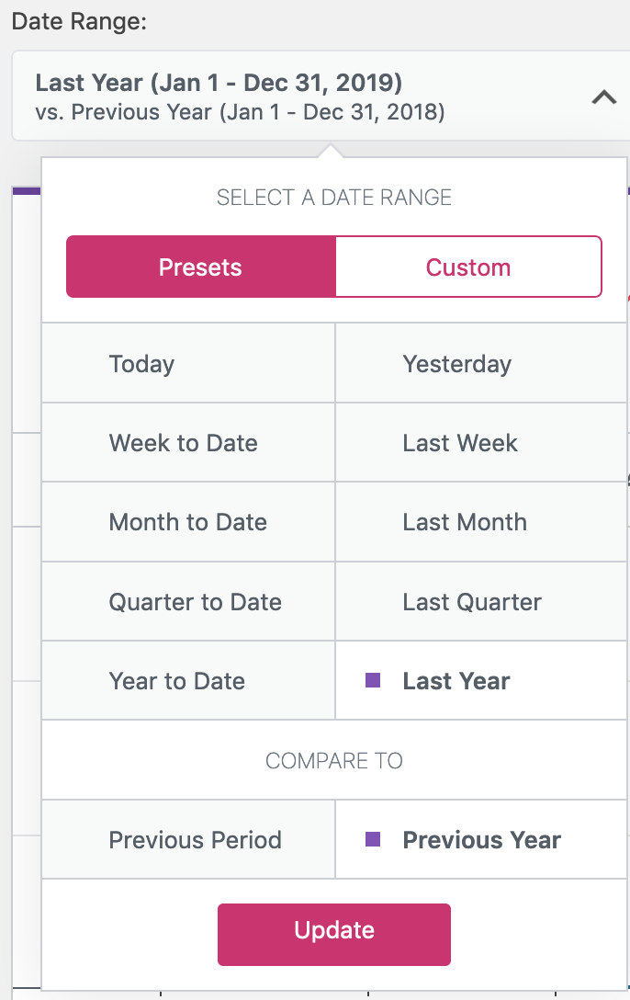
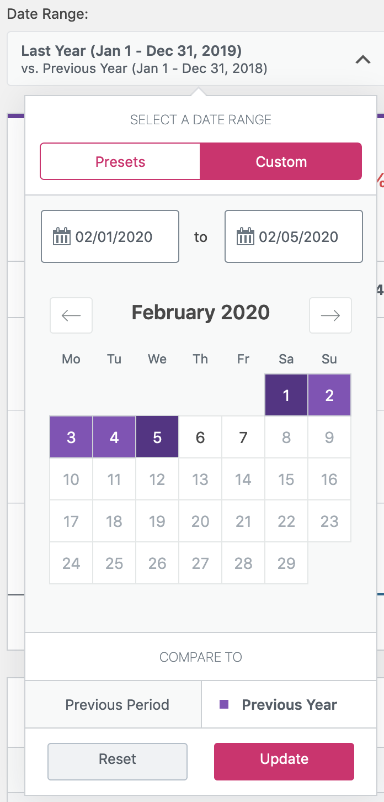
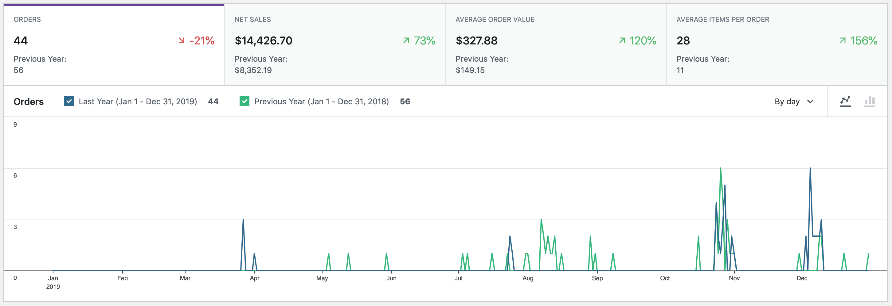
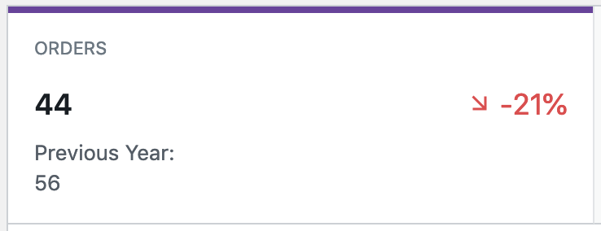
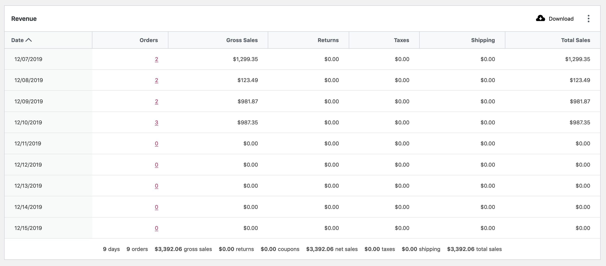
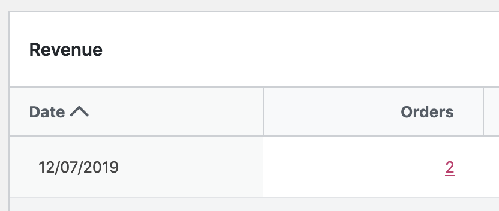
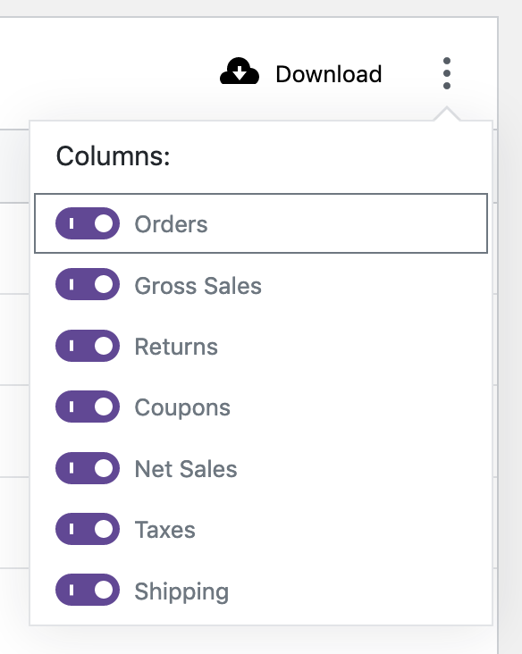
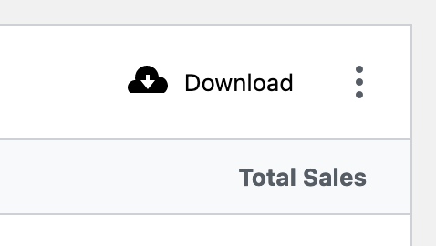

# Using WooCommerce Analytics Reports

Most of the new reports in the WooCommerce Analytics section have a set of common tools. This document will introduce you to those features, and how they can be utlized to customize and dive-deeper into the various new analytics reports.

## Date Range Picker

The Date Range picker allows you to specify which dates you want to include in the report being viewed. When you first open the Date Range Picker, a variety of popular _presets_ allow you to quickly chose some common date ranges:

-   Today
-   Yesterday
-   Week to date
-   Last week
-   Month to date
-   Last month
-   Quarter to date
-   Last year

You can also select which date range to compare against, either the same range from the _Prior Year_ or the _Prior Period_.

If the presets don't match your desired date range, click the _Custom_ tab at the top of the picker to have more granular control over the date range:

On the custom picker, you can either manually enter the start and end date using the provided input fields, or use the calendar to make your selection.

After either choosing a preset, or a custom date range, click the _Update_ button to modify the data in the report. Note by doing this, the date range selected is added to the address of the report URL - which allows you to bookmark, or share a report url with a specific date range to other Store admins. This date selection is persisted on the report view until you navigate away from the report.

## Advanced Filters

Depending on the report you are viewing, their might also be other Quick Filters and/or Advanced filters that allow you to further customize the data set being viewed.

If filter options are available, they will be shown next to the Date Range picker, or below it on narrow/mobile viewports. Much like the date range selection, filters are also persisted to the URL which allows you to save a quick link to a specific filtered version of a report. Available filters for each report are covered more in-depth in each report's documentation.

## Summary Numbers / Chart

At the top of the reports, the Chart and Summary numbers offer quick access to key data, trends of that data, and a visualization of changes over time in the period selected, and the period being compared against.

### Summary Numbers

The _Summary Number_ tab gives you a quick view at the total figure for that metric over the period selected, the total number for the period being compared, and the percentage trend between those two figures. By clicking on a Summary Number, that particular metric is then displayed in the chart.

### Chart

The charts on report pages offer quite a few options to customize the visualiztion of data. The data legend ( labeled A ) allows you to toggle the visiblity of the different data set periods. The _Interval Selector_ ( labeled B ) allows you to adjust the interval displayed in the chart. The options available here are dependent upon the length of the date range selected:

| Length of Date Range | Interval Options                          |
| -------------------- | ----------------------------------------- |
| One year or more     | 'day', 'week', 'month', 'quarter', 'year' |
| 90 days to 1 year    | 'day', 'week', 'month', 'quarter'         |
| 1 month - 89 days    | 'day', 'week', 'month'                    |
| 1 week - 28 days     | 'day', 'week'                             |
| 1 day - 1 week       | 'day'                                     |
| 1 day                | 'day', 'hour'                             |

And lastly, you can adjust the type of chart being displayed ( labeled B ) between a bar or line chart.

## Table

The table which displays the detailed data on Analytics reports also has a number of features that allow you to customize how the data is displayed, and even an option to download a csv copy the data used in the report for further analysis.

### Table Column Sorting

Many columns in reports will allow you to click on the column header to sort the tabular data by that value, and to either sort by that value in ascending or descending order. Simply click the column header to sort by that value, and click it again to change between ascending and descending sort.

### Toggle Column Visiblity

If a report contains a data column that you don't need to be displayed, you can adjust the visiblity of it by using the visibility menu on the right side of the table header. Click the column name in the menu to change the visibility of the column. Your visibility selections are persisted to your user preferences for each report, so on subsequent visits to that report, the columns you have previously toggled off will not be displayed.

### CSV Download

If you would like to download a copy of the data contained in the report table, you can do so by clicking the _Download_ button in the table header. If the amount of data shown in the report is limited to one page ( e.g. there is no pagination options shown in the table footer ), the csv file will download immediately.

If your selected date range results in a data set that spans more then one page in the table, your csv download will be processed as a background job by WooCommerce. Once the data is ready to be downloaded, an email will be sent to the address that is attached to your WordPress account with a link to download the file.

### Table Pagination

When the data displayed in the table is larger than the default single page size of 25, some pagination options will appear in the table footer area. Directional buttons, labeled `<` and `>` enable you to move backwards and forwards between pages, and a text field will allow you to jump to a specific page number. Furthermore you can change the number of rows to display per page.

### Table Search Box

On some reports, a search box is displayed in the table header area as well. For details on what the search box does on a given report, please refer to the associated documentaiton page for that report.
